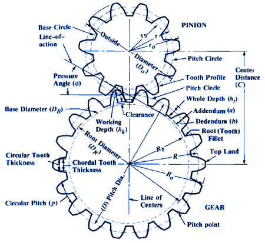

## Formula

Where:
* φ = Pressure Angle
* a = Addendum
* aG = Addendum of Gear
* aP = Addendum of Pinion
* b = Dedendum
* c = Clearance
* C = Center Distance
* D = Pitch Diameter
* DG = Pitch Diameter of Gear
* DP = Pitch Diameter of Pinion
* DB = Base Circle Diameter
* DO = Outside Diameter
* DR = Root Diameter
* F = Face Width
* hk = Working Depth of Tooth
* ht = Whole Depth of Tooth
* mG = Gear Ratio
* N = Number of Teeth
* NG = Number of Teeth in Gear
* NP = Number of Teeth in Pinion
* p = Circular Pitch
* P = Diametral Pitch

# Equations

    Base Circle Pitch	 DB = D cosφ  

    Circular Pitch       p = ( π D )/ N
                         p = π / P

    Center Distance      C = Np (mG + 1) / 2P
                         C = ( Dp + DG ) / 2
                         C = ( NG + Np ) / 2P
                         C = (NG + Np) p / 2P
                         C = (NG + Np) p / 6.2832

    Diametral Pitch      P = π / p
                         P = N / D
                         P = [ Np ( mG + 1) ] / 2C

    Gear Ratio           mG = NG / Np

    Number of Teeth      N = P D
                         N = ( π D ) / p
    
    Outside Diameter     DO = ( N + 2 ) / P
    (Full Depth Teeth)   DO = [ ( N + 2 ) p ] / π

    Outside Diameter     DO = ( N + 1.6 ) / P
    (American Standard   DO = [ ( N + 1.6 ) p ] / π
     Stub Teeth)

    Outside Diameter     DO = D + 2a

    Pitch Diameter       D = N / P
                         D = (N p ) / π

    Root Diameter	     DR = D - 2b

    Whole Depth          a + b

    Working Depth	     aG + ap

## Formulas for Tooth Parts, 20-and 25-degree Involute Full-depth Teeth ANSI Coarse Pitch Spur Gear Tooth Forms ANSI B6.1

To Calculate
Diametral Pitch,
P, Known
Circular Pitch,
p, Known

    Addendum                    a = 1.000 / P        a = 0.3183 × p

    Dedendum (Preferred)        b = 1.250 / P        b = 0.3979 × p

    (Shaved or Ground Teeth)a   b = 1.350 / P        b = 0.4297 × p

    Working Depth               hk = 2.000 / P       hk = 0.6366 × p

    Whole Depth (Preferred)     ht = 2.250 / P       ht = 0.7162 × p

    (Shaved or Ground Teeth)    ht = 2.350 / P       ht = 0.7480 × p

    Clearance (Preferred)b      c = 0.250 / P        c = 0.0796 × p

    (Shaved or Ground Teeth)    c = 0.350 / P        c = 0.1114 × p

    Fillet Radius (Rack)c       rf = 0.300 / P       rf = 0.0955 × p

    Pitch Diameter              D = N / P            D = 0.3183 × Np

    Outside Diameter            DO = (N + 2) / P     DO = 0.3183 × (N + 2) p

    Root Diameter (Preferred)   DR = (N − 2.5) / P   DR = 0.3183 × (N − 2.5) p

    Root Diameter               DR = (N − 2.7) / P   DR = 0.3183 × (N − 2.7) p     
    (Shaved or Ground Teeth)

    Circular Thickness Basic    t = 1.5708 / P       t = p / 2

## Reference
 - https://www.engineersedge.com/gear_formula.htm

