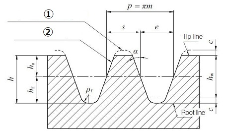
1. Reference tooth profile of a rack standardized for the mating gear
2. Reference tooth profile of a standard rack

## Symbols related to Gear Tooth Profile 

### Module
- Symbols : module 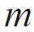
- Formula : p/π
- Definition : Module is the unit size indicated in millimeter (mm). The value is calculated from dividing the reference pitch by Pi (π).

### Pitch
- Symbols : pitch 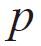
- Formula : πm
- Definition : Reference Pitch is the distance between corresponding points on adjacent teeth. The value is calculated from multiplying Module m by Pi(π).

### Pressure Angle 
- Symbols : pressure angle 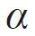
- Formula : (Degree)
- Definition : The angle of a gear tooth leaning against a normal reference line.

### Addendum
- Symbols : addendum 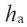
- Formula : 1.00m
- Definition : The distance between reference line and tooth tip.

### Dedendum
- Symbols : dedendum 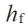
- Formula : 1.25m
- Definition : The distance between reference line and tooth root.

### Tooth Depth
- Symbols : tooth depth 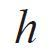
- Formula : 2.25m
- Definition : The distance between tooth tip and tooth root.

### Working Depth
- Symbols : working depth 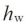
- Formula : 2.00m
- Definition : Depth of tooth meshed with the mating gear.

### Tip and Root Clearance 
- Symbols : tip and root clearance 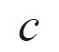
- Formula : 0.25m
- Definition : The distance (clearance) between tooth root and the tooth tip of mating gear.

### Dedendum Fillet Radius 
- Symbols : Dedendum fillet radius 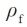
- Formula : 0.38m
- Definition : The radius of curvature between tooth surface and the tooth root.


## Base Circle Formula

Many gears have tooth forms made up of involute curves called involute tooth forms. The circle that serves as the
basis for drawing the involute curve is the base circle (db) which size is determined by the pressure angle (αlpha)
and the pitch circle diameter (d).

    db = d cos αlpha  
_base circle diameter formula_

Example:

    Gear Parameters:
    - Module: 5 (m)
    - Pressure Angle: 20° degrees or 1/9*pi radians (alpha)
    - Number of teeth: 30 (n)

    Gear Computed Diameters:
    Reference Diameter (d): 150 = n * m
    Base Diameter     (db): 140.95389 = d * cos(alpha) 

## The Involute Curve

The definition of involute curve is the curve traced by a point on a straight line which rolls without slipping 
on the circle. The circle is called the base circle of the involutes.

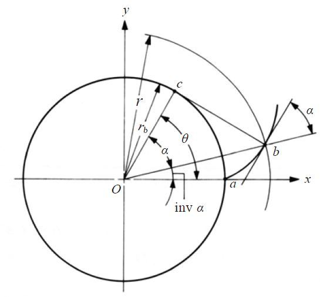

    $\alpha$ = cos-1(rb/r)

    inv $\alpha$ = tan($\alpha$) - $\alpha$ 

    x = r * cos(inv $\alpha$)
    y = r * sin(inv $\alpha$)

Exemplo:

    Gear Parameters:
    - Module: 5 (m)
    - Pressure Angle: 20° degrees or pi/9 radians ($\alpha$)
    - Number of teeth: 30 (n)

    Gear Computed Diameters:
    Reference Diameter (d): 150 = n * m 
    Reference Radius      :  75 = d / 2
    Base Diameter     (db): 140.95389 = d * cos(alpha) 
    Base Radius       (rb):  70.47695 = db / 2 
    Tip Diameter      (dt): 160 = d + (addendum * 2)  
    
| r (radius) | $\alpha$ (Pressure Angle) | x   | y   |
|------------|---------------------------| --- |-----|
| 70.47695   | 0.00000                   | 70.4769 | 0.000 |
| 72 | 11.80586°                 | 71.9997 | 0.2136 |
| 74 | 17.75087°                 | 73.9961 | 0.7628 |
| 76 | 21.97791°                 | 75.9848 | 1.5192 |
| 78 | 25.37123°                 | 77.9615 | 2.4494 |
| 80 | 28.24139°                 | 79.9218 | 3.5365 | 

    
    para r=72:
```math    
\alpha = \cos^{-1}({\frac{r_{b}}{r}})\newline
\alpha = \cos^{-1}({\frac{70.47695}{72}})\newline
\alpha = 0.2060510721 \therefore \alpha\frac{180}{\pi}=11.80586^{\circ}\newline

\newline
inv \alpha = tan(\alpha) - \alpha\newline
inv \alpha = tan(0.2060510721) - 0.2060510721\newline
inv \alpha = 0.2090175683 - 0.2060510721\newline
inv \alpha = 0.002966496168\newline

\newline
x = r \cdot \cos (inv\, \alpha)\newline
x = 72 \cdot \cos (inv\, \alpha)\newline
x = 71.9996832\newline

\newline
y = r \cdot \sin (inv\, \alpha)\newline
y = 72 \cdot \sin (inv\, \alpha)\newline
y = 0.2135874109
```

## Reference
- https://khkgears.net/new/gear_knowledge/gear_technical_reference/involute_gear_profile.html
- https://khkgears.net/new/gear_knowledge/gear-nomenclature/base-circle.html
- Vídeo [Involute Gears Explained](https://www.youtube.com/watch?v=nrsCoQN6V4M)

- [LaTeX tester online](https://latex.codecogs.com/eqneditor/editor.php)